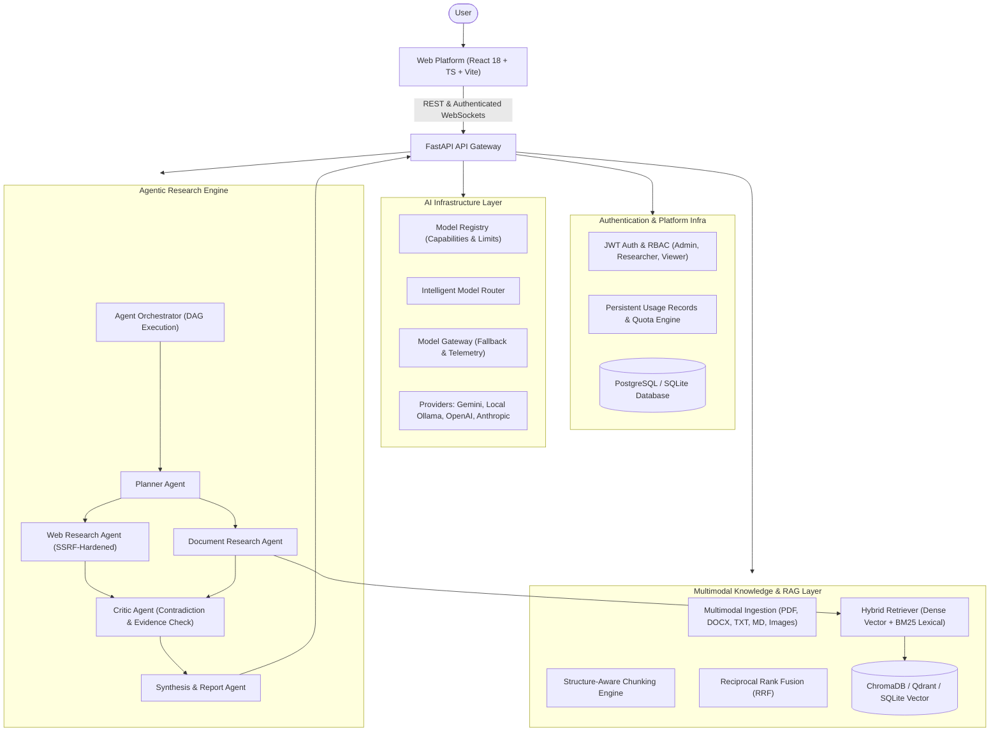

# Agentic Multimodal Research Platform

<p align="left">
  <a href="https://github.com/Om-Talaviya"></a>
  
  
  
</p>

A production-grade, multi-agent AI research operating system that takes complex research questions, investigates across multiple modalities (text, PDFs, documents, images, web), retrieves relevant knowledge, reasons, critiques evidence, and produces structured, evidence-backed research reports with verifiable citations in real time.

> **Key Distinction**: *This is not just a chatbot.* It is an **Autonomous AI Research Operating System** designed around specialized agent collaboration (`Plan → Investigate → Retrieve → Reason → Critique → Synthesize → Report`) rather than single-prompt LLM calls.

---

## 🏛️ System Architecture Overview



---

## 🚀 Key Platform Features

- **Multi-Agent Research Pipeline**: Coordinated workflow across `Planner → Web/Doc Agents → Critic → Synthesis → Report`.
- **Multimodal Ingestion**: Automated parsing for PDF (with table extraction), DOCX, TXT, Markdown, and Images (Vision analysis via Model Gateway).
- **Hybrid Retrieval & RRF**: Dense semantic search combined with BM25 keyword matching via Reciprocal Rank Fusion ($k=60$).
- **Intelligent Model Routing (Phase 8A)**:
  - Dynamic model selection based on task requirement: fast/cheap models for classification, reasoning models for planning/critique, vision models for image analysis, large-context models for synthesis.
- **Persistent Usage & Quota Engine (Phase 8B)**:
  - Real-time token and cost tracking with transactional row locking to eliminate quota oversubscription under heavy concurrency.
  - Quota-aware model fallback.
- **Evidence Gating & Citation Integrity**:
  - Full provenance for every claim with interactive citation badges (`[1]`, `[2]`), confidence scoring, and source passage inspectors.
  - Automatic pruning of ungrounded statements.
- **Real-Time WebSocket Streaming**: Live progress broadcasts (`Planning... → Searching... → Analyzing... → Critiquing... → Synthesizing... → Completed`).

---

## 📊 Current Project Status & Completed Phases

| Phase | Milestone | Status | Key Deliverables |
| :--- | :--- | :--- | :--- |
| **Phase 1** | Foundation | 🟢 COMPLETE | FastAPI backend, React/TS/Vite frontend, shared packages, tests, Docker. |
| **Phase 2** | Research MVP | 🟢 COMPLETE | DAG task execution, Planner/Report agents, synthesis, streaming. |
| **Phase 3** | Multimodal Ingestion | 🟢 COMPLETE | PDF, DOCX, TXT, Markdown, and image vision processing pipeline. |
| **Phase 4** | Agentic System | 🟢 COMPLETE | Tool registry, SSRF-hardened web fetch, search tools, Critic agent. |
| **Phase 5** | RAG / Knowledge Core | 🟢 COMPLETE | Hybrid RRF retriever, BM25, ChromaDB/SQLite vector stores, citations. |
| **Phase 6** | Production & Security | 🟢 COMPLETE | JWT auth, RBAC, prompt injection security filters, Prometheus metrics. |
| **Phase 7** | Application Maturity | 🟢 COMPLETE | Dashboard mapping fix, persistent users, Gemini provider alignment. |
| **Phase 8A** | Intelligent Model Routing | 🟢 COMPLETE | `ModelRegistry`, `ModelRouter`, `ModelGateway`, capability-based dispatch. |
| **Phase 8B** | Usage & Quota Tracking | 🟢 COMPLETE | Persistent `UsageRecord`, `UserQuota`, concurrency row locking, user attribution. |
| **Phase 9** | **Knowledge Automation** | 🟡 **NEXT** | Automatic ingestion-to-research bridge & planner knowledge integration. |

---

## 🛠️ Quick Start

### Prerequisites
- Docker & Docker Compose
- Python 3.10+ and Node.js 20+ (for local development)
- Ollama (optional for local models)

### 1. Run with Docker Compose (Recommended)
```bash
# Clone the repository
git clone <repo-url>
cd knowledge-intelligence-platform

# Copy environment template
cp .env.example .env

# Launch services
docker compose up -d

# Frontend: http://localhost:3000 (or http://localhost:5173)
# Backend API & Docs: http://localhost:8000/docs
```

### 2. Local Development

#### Backend
```bash
cd backend
python -m venv .venv
source .venv/bin/activate  # On Windows: .venv\Scripts\activate
pip install -e .[dev,embeddings]

# Run tests
pytest tests/ -v

# Start FastAPI server
uvicorn kip.api:app --reload --host 0.0.0.0 --port 8000
```

#### Frontend
```bash
cd frontend
npm install
npm run dev
```

---

## 🗺️ Long-Term Evolution: AI Research Operating System

The project evolves across 6 major generations:
1. **Gen 1 — Intelligent Research Core**: Phase 9 (Knowledge Automation) → Phase 10 (Evidence & Citation Intelligence) → Phase 11 (Advanced Research Planning).
2. **Gen 2 — Multimodal Intelligence**: Phase 12 (Advanced Multimodal) → Phase 13 (Dataset & Data Analysis) → Phase 14 (Document & Paper Intelligence).
3. **Gen 3 — Autonomous Research**: Phase 15 (Deep Research Engine) → Phase 16 (Research Memory) → Phase 17 (Long-Term Knowledge Graph).
4. **Gen 4 — Collaboration Platform**: Phase 18 (Projects & Workspaces) → Phase 19 (Team Collaboration).
5. **Gen 5 — AI Platform Intelligence**: Phase 20 (Intelligent Model Ecosystem) → Phase 21 (Model Evaluation) → Phase 22 (Agent Evaluation).
6. **Gen 6 — Production Product**: Phase 23 (Enterprise Security) → Phase 24 (Production Scale) → Phase 25 (Public API) → Phase 26 (Research Automation).
