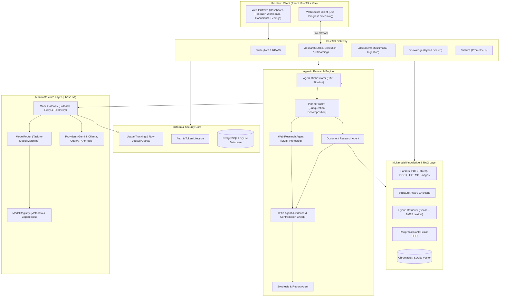

# System Architecture — Agentic Multimodal Research Platform

This document details the architectural topology, subsystem boundaries, data contracts, and long-term design of the **Agentic Multimodal Research Platform** (AI Research OS).

---

## 1. Complete Architecture Diagram



---

## 2. Subsystems & Component Responsibilities

### 2.1 Agentic Research Pipeline
1. **Planner Agent**: Decomposes broad questions into manageable sub-investigations, scopes required evidence sources, and constructs DAG tasks.
2. **Web Research Agent**: Queries external web search APIs, safely fetches live pages (with comprehensive SSRF defenses blocking private/loopback/multicast IPv4/IPv6 addresses), and summarizes relevant text.
3. **Document Research Agent**: Interfaces directly with the knowledge retrieval layer to pull internal files and user evidence.
4. **Critic Agent**: Reviews incoming evidence from web and document agents. Identifies knowledge gaps, ungrounded claims, and contradictions. Re-triggers research tasks if confidence is below threshold.
5. **Synthesis & Report Agent**: Aggregates verified evidence into structured executive summaries, findings tables, methodology notes, and citation maps.

### 2.2 Intelligent Model Infrastructure (Phase 8A & 8B)
- **Model Registry**: Centralized repository of model configurations, rate limits, token costs, context capacities, and vision support.
- **Model Router**: Intelligently matches incoming tasks to the best-suited model.
- **Model Gateway**: Handles provider communication, error translation, fallback chains, and usage telemetry.
- **Usage & Quotas**: Real-time token consumption ledger with concurrency-safe row locking.

---

## 3. Long-Term Architectural Target (AI Research OS)

```
                            ┌───────────────────────────────────┐
                            │          AI RESEARCH OS           │
                            └─────────────────┬─────────────────┘
                                              │
        ┌─────────────────────────────────────┼─────────────────────────────────────┐
        ▼                                     ▼                                     ▼
┌────────────────┐                   ┌────────────────┐                    ┌────────────────┐
│Research Engine │                   │Knowledge Engine│                    │ Data Analysis  │
└───────┬────────┘                   └───────┬────────┘                    └───────┬────────┘
        │                                    │                                     │
        └────────────────────────────────────┼─────────────────────────────────────┘
                                             ▼
                                     ┌────────────────┐
                                     │  Agent System  │
                                     │ (Plan/Web/Doc/ │
                                     │ Critic/Synth)  │
                                     └───────┬────────┘
                                             ▼
                                     ┌────────────────┐
                                     │Evidence-Backed │
                                     │ Structured Rpt │
                                     └────────────────┘
```
