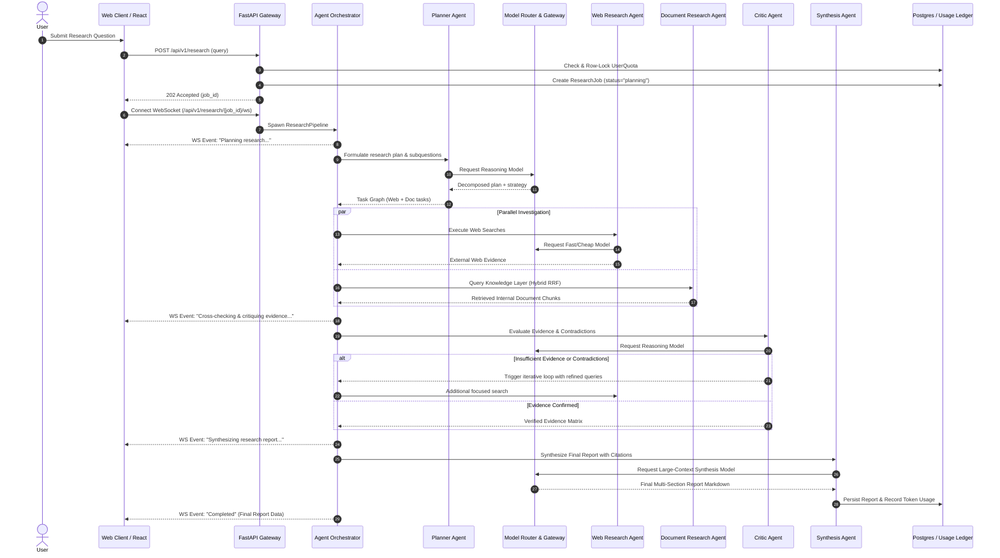
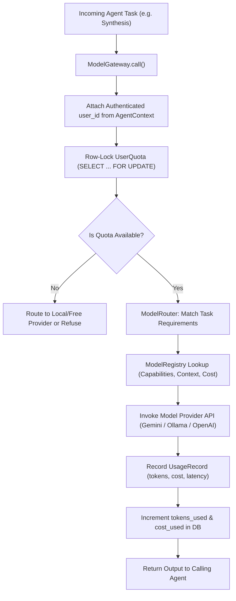

# System & Data Flows — Agentic Multimodal Research Platform

This document illustrates the execution lifecycles, agentic loops, and model routing pipelines.

---

## 1. End-to-End Autonomous Research Flow

---

## 2. Model Routing & Quota Enforcement Flow (Phase 8A & 8B)

---

## 3. Knowledge Automation Ingestion Lifecycle (Phase 9 Target)

```mermaid
flowchart LR
    Upload["1. Upload Doc / PDF / Image"] --> Validate["2. Validate & Sanitize"]
    Validate --> Extract["3. Extract Hierarchy & Tables"]
    Extract --> Normalize["4. Normalize Text & Blocks"]
    Normalize --> Chunk["5. Structure-Aware Chunking"]
    Chunk --> Embed["6. Compute Embeddings"]
    Embed --> Index["7. Upsert to Vector Store & BM25"]
    Index --> Ready["8. Knowledge Ready for Agents"]
```

